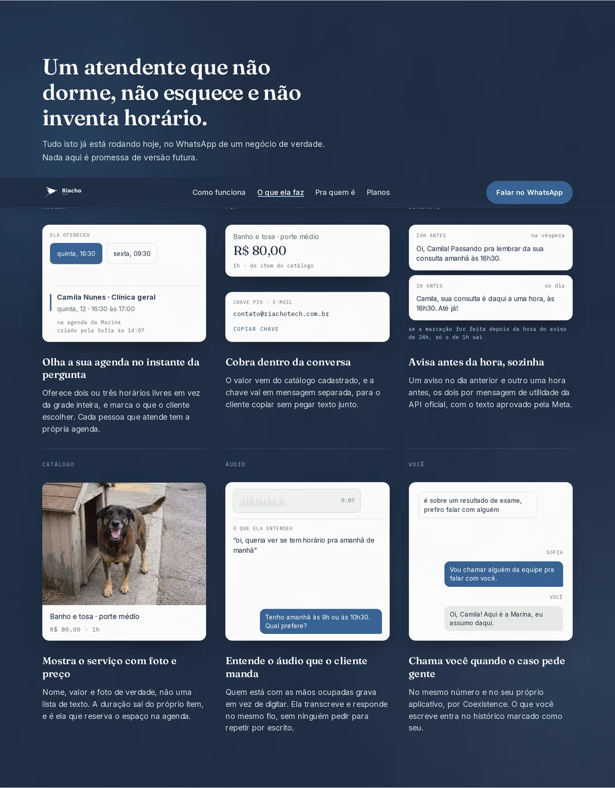
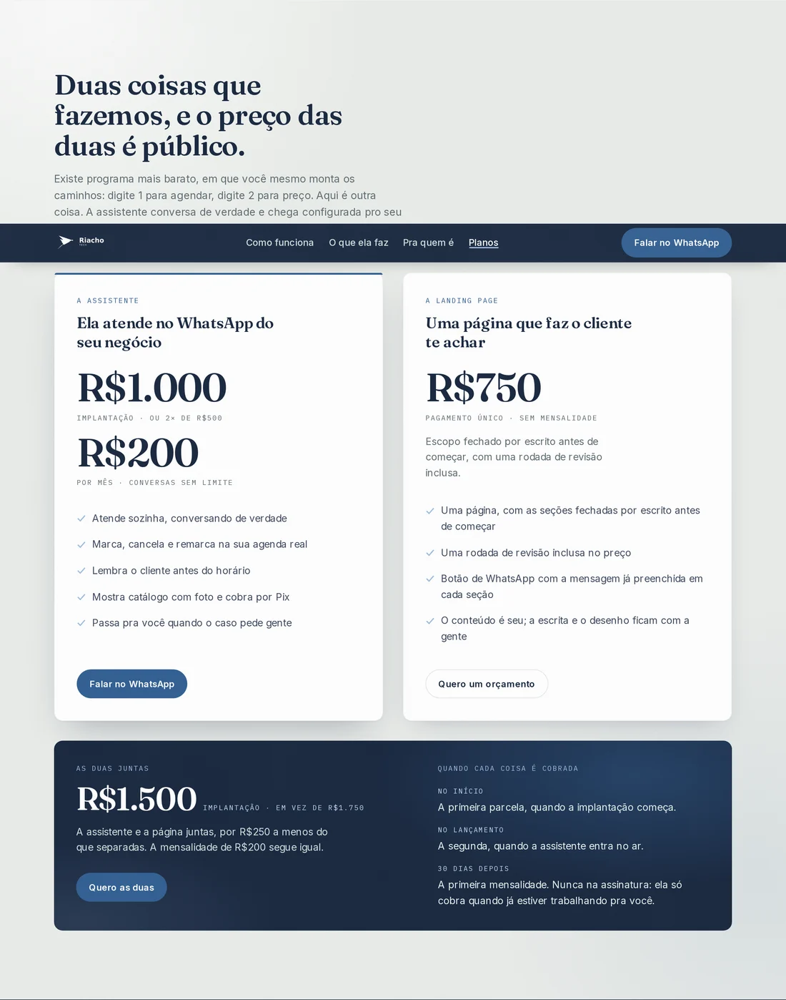

# riachotech-site

Site institucional da Riacho Tech, no ar em
[riachotech.com.br](https://riachotech.com.br). A home é Next 15 + TypeScript em
export estático — o servidor continua sem rodar build, só que agora o HTML sai
pronto do `npm run build` em vez de ser escrito à mão. Três páginas herdadas
(`privacidade.html`, `404.html` e `conectar/`) seguem em HTML com Tailwind
compilado e commitado, e não mudam uma palavra.

**Repositórios irmãos:**
[`sofia-vitrine`](https://github.com/andrenv14/sofia-vitrine), a arquitetura do
produto · [`sofia-eval`](https://github.com/andrenv14/sofia-eval), a avaliação
de comportamento do modelo · [`sofia-agents`](https://github.com/andrenv14/sofia-agents), o processo
de trabalho.

---

## O site

A primeira tela, em 1280 px. O celular da direita é markup da própria página, e
a conversa de abertura chega mensagem a mensagem em vez de já estar lá. Não é
captura de WhatsApp e não há cliente real nela — as perguntas são sobre a
própria Riacho, porque o botão ao lado leva para o número onde a Sofia atende
de verdade.

"O que ela faz" é a seção que carrega o argumento. Cada bloco mostra o
**artefato** daquela capacidade em vez de afirmá-la: o evento como nasce no
Google Agenda, as duas mensagens da cobrança, os dois lembretes, o item do
catálogo, o áudio transcrito e a conversa mudando de mão com a marca de quem
falou. Três dos seis respondem ao toque — escolher um horário reescreve o evento
**e** os dois lembretes, porque as três peças leem o mesmo objeto.

"Como funciona" conta o fluxo pela HORA, e não por `01 — 02 — 03`: um ordinal
diz "este é o segundo", a hora diz "isto levou um minuto", que é o argumento de
venda. O rastro azul atravessa os três passos um de cada vez.

Em 390 px, três telas de celular — a primeira, o começo de "o que ela faz" e a
lista de ramos. A lista troca o exemplo por ramo (clínica, escritório,
barbearia, petshop, oficina) sem recarregar nada, e as cinco conversas fecham o
agendamento: antes elas paravam na pergunta, e mostravam a Sofia oferecendo sem
nunca marcar.

Da esquerda para a direita: a primeira tela, "o que ela faz" e "pra quem é".

  
  
  

<!-- Largura fixa em ``, e não uma tabela de três colunas: numa tabela o
     GitHub dimensiona cada coluna pelo conteúdo do cabeçalho, então "a primeira
     tela" e "pra quem é" davam colunas de larguras diferentes e as três telas
     saíam com tamanhos diferentes, embora os arquivos tenham os mesmos 780x1688.
     Achado do fundador. -->

E a seção de planos, que é onde o site precisa ser mais claro:

## Stack

- **Home** — Next 15, React 19, TypeScript, Tailwind 4, `output: 'export'`. Sem
  servidor: o `npm run build` gera arquivos estáticos. Os tokens de cor,
  tipografia e raio vivem no `@theme` de `app/globals.css`, que é a fonte
  executável da marca.
- **Fontes** — Fraunces, Inter e IBM Plex Mono vêm por `next/font`, baixadas no
  BUILD e servidas do próprio domínio. Isso mudou desde a versão anterior deste
  README, que dizia o contrário: antes elas vinham do Google Fonts pela rede, e
  se a rede falhasse a página renderizava com fonte de sistema sem nada acusar.
  As três páginas herdadas ainda dependem do Google Fonts.
- **Páginas herdadas** — `privacidade.html` e `404.html` consomem o `site.css`,
  Tailwind compilado a partir de `build/tailwind-input.css` e commitado, porque
  o servidor não roda build. `conectar/` tem `<style>` próprio.
- **Zero biblioteca de animação.** Todo movimento é CSS, e todo movimento
  desliga com `prefers-reduced-motion`.

## O que vale olhar aqui

**`build/conferir-estaticas.js`** é o portão do export, e roda dentro do
`npm run build`. São 11 conferências, e a que mais importa: a âncora
`#uso-limitado-google` da política de privacidade tem de continuar existindo —
ela está num e-mail ao time de verificação OAuth do Google, e um revisor vai
abri-la. O portão também prova que o texto legal saiu idêntico ao da origem, e
tem um controle negativo (uma âncora inventada que ele precisa NÃO encontrar),
porque comando que devolve vazio não distingue "não achei" de "não olhei".

**`build/medir-site.js`** abre qualquer página em 390, 820 e 1280 px e devolve
números: contraste reprovado por par cor/fundo composto, corpo abaixo de 16 px,
alvo de toque menor que 44×44, rolagem horizontal, erro de console. Nenhuma
mudança visual vai ao ar sem passar por ele.

**`build/detectar-tells.js`** conta os padrões que fazem uma página parecer
gerada: densidade de travessão, rótulo mono repetido, rótulo numerado, hero que
não cabe na tela, duas chamadas querendo a mesma coisa na primeira tela, e raio
de canto não concêntrico. Ele conta; o julgamento é de quem lê.

**`build/texto-visivel.js`** extrai o texto visível de uma página antes e depois
de uma mudança e compara os dois. Foi ele que garantiu que a política de
privacidade mudasse de forma sem perder uma palavra.

**`build/servir-gzip.js`** serve o export COM compressão, que é o que a VPS faz.
Medir sem gzip contra uma produção que comprime dá um número pessimista sobre um
servidor que não existe — a diferença medida foi de 27 pontos de Lighthouse.

**`.claude/skills/`** é como se trabalha neste site. A `design-site` traz o chão
de regras (contraste, medida de linha, alvos, estados, foco visível) e o fluxo
de acabamento; a `nao-slop` traz o que vem antes e depois disso — declarar a
leitura antes de desenhar, e os tells contáveis depois. Escrevi as duas a partir
do que serve no kit `impeccable` do `pbakaus`
([Apache 2.0](https://github.com/pbakaus/impeccable)) e da `taste-skill` do
`Leonxlnx`, que não instalei: o primeiro traz um hook que reescreve
`.claude/settings.local.json` a cada edição de interface, e permissão só muda
quando uma pessoa decide.

## Medido

Nas três páginas, com o servidor local com gzip e o Chromium do Playwright:

| | home | privacidade | 404 |
|---|---:|---:|---:|
| acessibilidade | 100 | 100 | 100 |
| performance | 89 | 93 | 95 |
| boas práticas | 96 | 100 | 96 |
| SEO | 100 | 63 | 60 |
| CLS (quanto a página pula ao carregar) | 0 | 0,021 | 0 |
| contraste reprovado (390/820/1280) | 0 | 0 | 0 |
| corpo abaixo de 16 px | 0 | 0 | 0 |
| alvo abaixo de 44×44 | 0 | 3 em 390, 5 acima | 0 |

O SEO baixo nas duas últimas é `is-crawlable`, e é de propósito: as duas têm
`<meta robots noindex>`.

Os alvos da política são links dentro de parágrafo — exceção declarada na skill.
**São 3 em 390 px e 5 em 820 e 1280**, e a versão anterior deste README dizia
"3" porque só o número de 390 tinha sido lido. Os dois que só aparecem acima de
390 são o link "Google API Services User Data Policy", que em telas largas cabe
numa linha e nas estreitas quebra em duas — quebrado, ele deixa de ser contado
como um alvo baixo. É o mesmo engano que a barra de topo escondeu por semanas:
lá os dois únicos alvos reprovados da home sumiam da medição porque em 390 o
nav os esconde. **Medida de acessibilidade lida numa largura só é medida
incompleta**, e as duas vezes o buraco ficou do mesmo lado.

A performance da home não é meta, e isso é decisão do dono: CLS zero não se
troca por pontos. O número oscila de 89 a 93 entre rodadas — o que se persegue é
regressão grande, e uma apareceu: a luz do hero, animando desde o primeiro
quadro, custou 4 pontos e meio segundo de LCP. Dois segundos de atraso no início
da animação devolveram os dois, e ninguém vê diferença numa ida e volta de 26 s.

## Escopo

O redesign de 08/09/2026 mexeu na home inteira e não tocou nas três páginas
herdadas. O que mudou de fundo:

- **artefato no lugar de afirmação** — a seção de capacidades mostrava dois
  blocos sem nenhuma prova, e um deles era o principal;
- **peças alinhadas por faixa** — em cada faixa de blocos, as peças esticam e o
  conteúdo se distribui, então topo e pé caem na mesma linha em qualquer
  largura. Antes o vão entre a peça e o título ia de 28 a 146 px na mesma faixa;
- **textura em duas escalas** — grão fino de perto e mancha larga de longe, as
  duas em SVG embutido no CSS, sem arquivo nem requisição. Grão fino sozinho
  some: o olho o integra e volta a ver cor lisa;
- **movimento que informa** — a conversa do hero chegando, o rastro do tempo, o
  lembrete que chega, a seção corrente acesa na barra. Nenhum é entrada de
  seção, que é o padrão que a `nao-slop` reprova.

O que **não** se faz aqui: telefone de cliente, nome de cliente, captura de
conversa real, e nada que se pareça com credencial. A peça do Pix mostra a chave
como e-mail, que é o `contato@riachotech.com.br` já publicado no rodapé — uma
versão anterior desenhava um código copia-e-cola plausível, e invenção com cara
de chave é pior que invenção nenhuma, porque quem lê não tem como saber que é
falsa.

## Operação

- `npm run build` gera o export em `out/` e roda o portão das 11 conferências.
- `npm run servir` sobe `out/` em `127.0.0.1:8111` com gzip, que é o que a VPS
  entrega. O servidor manda `max-age=300`: ao recarregar depois de um build, use
  `?v=alguma-coisa` na URL, senão você mede a página anterior.
- `npm run medir` mede qualquer página nos três tamanhos; `npm run tells` conta
  os tells; `npm run og` regenera a prévia do link a partir dos próprios tokens.
- **O formato do deploy está em aberto.** Hoje o diretório servido é um clone
  deste repositório e o Nginx nega dotfiles, `README.md`, `docs/`, `build/`,
  `nginx/` e `package*.json` — negações que estão no conf versionado. Com a home
  virando export, a proposta registrada é o diretório servido passar a ser
  artefato puro (só o conteúdo de `out/`), o que torna as negações
  desnecessárias. Dois requisitos travam qualquer forma: a URL
  `privacidade.html` **com** `.html` não muda, e a âncora
  `#uso-limitado-google` não some.
- `conectar/` é a página do Embedded Signup (o fluxo oficial da Meta para o
  cliente conectar o número dele), aberta a partir de um link de convite
  assinado. Ela não guarda segredo: o id do app e o da configuração são públicos
  por natureza, e o token do convite é validado no back-end.
